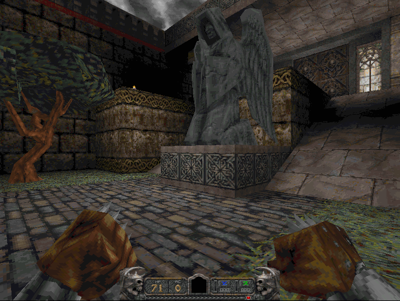

# Hexen 2 port to WebAssembly

[PLAY HEXEN II IN YOUR BROWSER NOW](https://henrydn.github.io/uhexen2/docs/index.html)

## Introduction

In 2000, Raven software, the original developer of [Hexen 2](https://en.wikipedia.org/wiki/Hexen_II) released the source code of the game engine into the [public domain](https://www.shacknews.com/article/10452/hexen-2-source-code-released). Since then, many source ports have been created, the most popular of which seems to be [Hexen II: Hammer of Thyrion](http://uhexen2.sourceforge.net/). The *Hexen II: Hammer of Thyrion* project has ported the game to Mac, Linux, Amiga, and other platforms, fixing many bugs in the process and bringing new features like OpenGL and SDL support to the game.

This is a fork of the *Hexen II: Hammer of Thyrion* project to port the game to web Web-Assembly using [Emscripten.](https://emscripten.org/)

Even though the source code is public domain, the game isn't, and therefore the game files of the retail version is not distributed with this release. You can either use the game files of the CD version of the game, or of the Demo version, which is public domain.

## How to build
 
- Install Emscripten
- Copy the original game data directory (Data1) to the /engine/hexen2 directory
- Run build.sh in the /engine/hexen2 directory
- Serve the contents of /engine/hexen2/em on a webserver

## Known issues

- Mouse movement does not currently work because of a linker issue where the SDL_GetRelativeMouseState symbol cannot be resolved.
- Networking support has been removed because it doesn't make sense for running in a browser
- The original game played music from CDROM. Midi/OrgVorbis/CDAudio support has been disabled for now to simplify the build process, but this can be added back at a later point